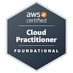
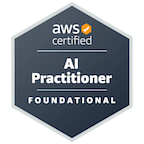
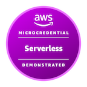

<h1 align="center">Tiago Gonçalves de Castro</h1>

  

  
  
  
  
  
  
  
  

  <a href="https://tiagogcastro.com.br"><strong>tiagogcastro.com.br</strong></a> ·
  <a href="https://www.linkedin.com/in/tiagogcastro">LinkedIn</a> ·
  <a href="./.github/Tiago_Castro_Curriculo_Desenvolvedor_Fullstack_Cloud.pdf">Currículo</a> ·
  <a href="./.github/Tiago_Castro_Resume_Fullstack_Cloud_Developer_en_US.pdf">Resume</a> ·
  <a href="mailto:tiagogcastro1@gmail.com">Email</a>

---

## About

Fullstack Cloud Developer (Systems Analysis and Development graduate) with full-level
experience in web systems, APIs, marketplace platforms, Data Lake, infrastructure as code
and AI applied in production. I work end to end: product development, cloud architecture,
integrations, automations and infrastructure optimization.

**HITSS | Lakeit** (Jan 2024 - present): technical evolution of an enterprise Data Lake
platform in production with active customers. Reorganized AWS infrastructure with
Terraform/Terragrunt (cutting monthly costs from $2,300+ to $800-1,000), evolved
event-driven pipelines (S3, SQS, SNS, Step Functions, Glue, Athena, Lambda, Lake Formation)
and built an AI assistant for data exploration with Bedrock, RAG and Athena SQL generation.

**Futbuynow** (Feb 2023 - present, freelance technical owner): marketplace for digital
products in the gaming niche with 11,000+ users and 20,000+ paid orders. Monorepo with
Node/Express API, React/Vite dashboard and Next.js website; OpenPix, Stripe and PayPal
flows; technical SEO that reached 30.4k organic clicks in 12 months.

## Certifications & Badges

View all my credentials on [Credly](https://www.credly.com/users/tiagogcastro).

  
  
  

- **AWS Certified Cloud Practitioner (CLF-C02)** - Sept 2026 ([view credential](https://www.credly.com/badges/2e86b275-895d-49f4-807e-d6e264ef47e4/public_url))
- **AWS Certified AI Practitioner (AIF-C01)** - Sept 2026 ([view credential](https://www.credly.com/badges/f21d87ea-e9df-46b9-9d0b-938f728f79b6/public_url))
- **AWS Serverless Demonstrated** - Aug 2026 ([view badge](https://www.credly.com/badges/c12ab3fd-2e95-4f3e-b4db-9d1eb75be81d/public_url))

## Professional Development

- **Google Cloud: Get Certified program** - guided preparation program with instructor-led training and technical mentorship, joined September 11, 2026 ([learn more](https://developers.google.com/profile/badges/community/get-certified-26-edition-3?u=tiagogcastro&hl=pt-br))

## Portfolio

Check out my portfolio site: [tiagogcastro.com.br](https://tiagogcastro.com.br) - websites, systems and digital products I build and evolve.

Link da comunidade no WhatsApp: [clique aqui](https://chat.whatsapp.com/IyGb5aqFU2QIqEMSI2qCY4)

## GitHub stats

  
  

  
  

## Tech stack

  

  

